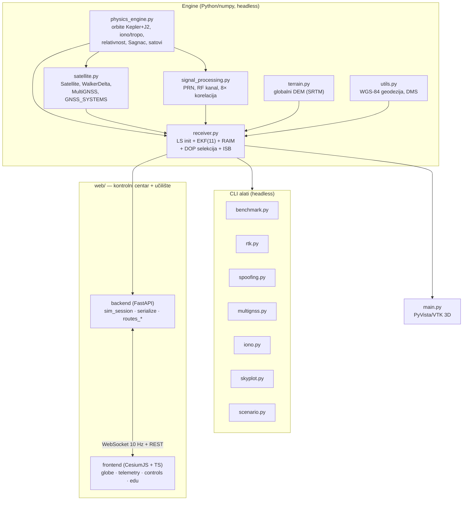
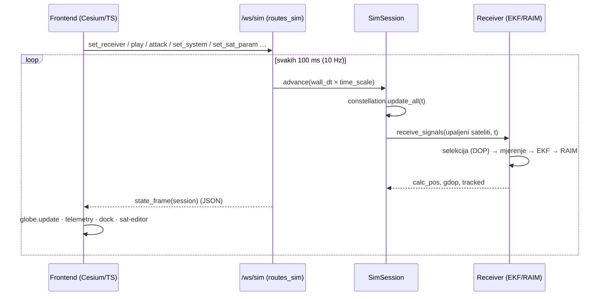
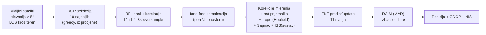
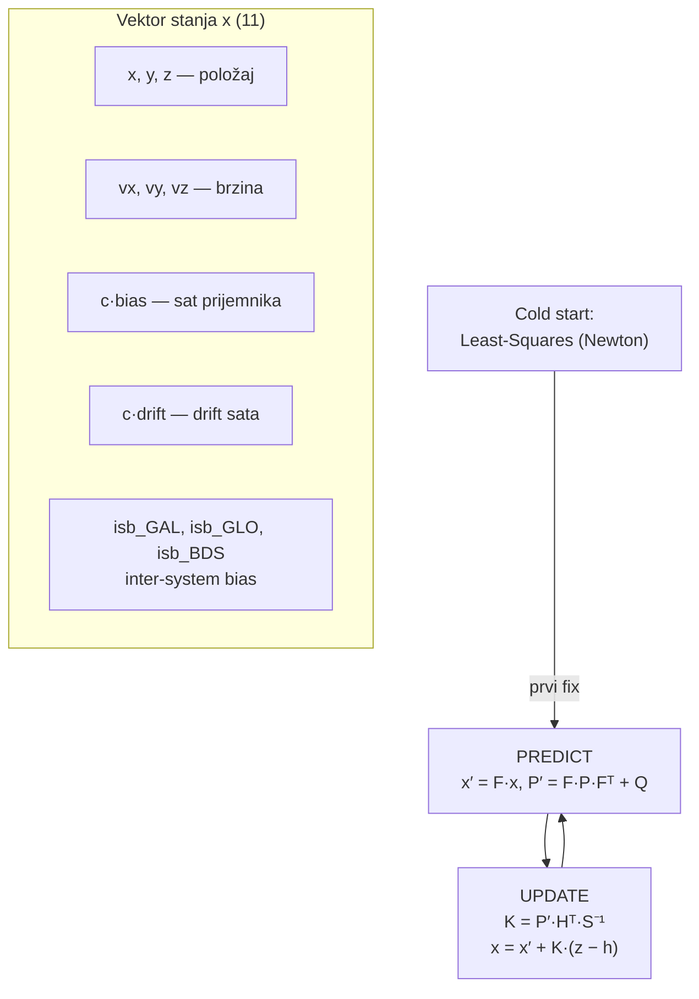

# GPS Simulator 3D — Tehnička dokumentacija i osvrt

Detaljan pregled arhitekture, algoritama, fizičkih modela i inženjerskih odluka
u **GPS Simulatoru 3D**. Projekt je narastao iz geometrijskog kalkulatora u
visokofidelitetni GNSS simulator s **pravim** navigacijskim solverom (EKF + RAIM
+ iono-free + inter-system bias) i modernim web učilištem.

> Za pokretanje, instalaciju i CLI alate vidi [`README.md`](README.md) i
> [`web/README.md`](web/README.md). Ovaj dokument opisuje **kako stvari rade
> iznutra** — i pošteno kaže što je stvarno, a što pojednostavljeno.

---

## 1. Što je ovo (i što nije)

Dvije razine, isti numpy engine:

- **Engine (headless)** — čisti Python/numpy: konstelacije, orbite, fizika
  kanala, obrada signala i navigacijski procesor. Radi bez GPU-a, testira se na
  CI-ju, pogoni sve CLI alate (`benchmark`, `rtk`, `spoofing`, `multignss`…).
- **Sučelja** — dva "klijenta" nad istim engineom:
  - **`main.py`** — desktop 3D (PyVista/VTK).
  - **`web/`** — kontrolni centar + GPS učilište (FastAPI + CesiumJS), dvojezično
    HR/EN, živa simulacija preko WebSocketa.

**Ključna poanta:** sve iznad simulacije *signala* je autentično. Navigacijski
solver je pravi GNSS algoritam — isti kakav bi radio i na stvarnim mjerenjima
(vidi §8).

Tehnologije: Python 3.11–3.14 · numpy · FastAPI · uvicorn · PyVista/VTK ·
CesiumJS · TypeScript (vanilla, bez frameworka) · Vite.

Opseg (grubo): engine ~3.100 linija Pythona, web ~3.800 linija TypeScripta +
~600 linija backend Pythona, 61 testova, CI na Pythonu 3.11–3.13.

---

## 2. Arhitektura

### Inventar modula (engine)

| Modul | Linija | Uloga |
|-------|-------:|-------|
| `physics_engine.py` | 272 | Keplerove orbite + J2, Klobuchar ionosfera, Hopfield troposfera, Sagnac, relativistički driftovi, Allanov model sata, sporo-promjenjiva (OU) ephemeris greška |
| `satellite.py` | 183 | `Satellite` (orbita + sat + PRN + ephemeris stanje), `WalkerDeltaConstellation` (GPS 24/6/1), `MultiGNSSConstellation` (GPS/GAL/GLO/BDS, 96 sat.), `GNSS_SYSTEMS` (parametri + ISB) |
| `signal_processing.py` | 158 | PRN kodovi, RF kanal (**korelirani L1/L2 multipath** + AWGN), **8× naduzorkovana** FFT korelacija, dekodiranje pseudoudaljenosti |
| `receiver.py` | 520 | LS "cold start" → **11-D EKF** → RAIM → DOP selekcija; iono-free, tropo korekcija, Sagnac, **ISB procjena**, `ideal` mod |
| `terrain.py` | 94 | Globalni DEM (`terrain_dem.npz`, NASA SRTM), bilinearna interpolacija |
| `utils.py` | 92 | LLA ↔ ECEF (WGS-84, Bowring — sub-mm točnost), DMS format |
| `main.py` | 478 | Desktop PyVista GUI (jedini dio koji traži GPU) |
| `rtk.py` / `spoofing.py` / `multignss.py` / `scenario.py` / `benchmark.py` / `iono.py` / `skyplot.py` | 172–342 | Samostalni headless alati (PNG / statistika / JSON scenariji) |

Web backend (`web/backend/`): `app.py` (FastAPI app + singleton sesija),
`sim_session.py` (živa sesija), `serialize.py` (numpy→JSON frame),
`routes_sim.py` (WebSocket), `routes_meta/experiments/scenario.py` (REST).

Web frontend (`web/frontend/src/`): `globe/` (Cesium), `ui/` (kontrole,
telemetrija, dok s grafovima, editor satelita, kompas, fly-to), `edu/`
(pojmovnik, vođene lekcije, "objasni ovo", dugoformni vodič "GPS objašnjen"),
`lib/` (WebSocket, i18n, tipovi).

---

## 3. Živi simulacijski lanac (web)

Server drži **jednu** `SimSession` u `app.state` (preživi reload stranice) i
strimuje serijalizirano stanje ~10×/s. Klijent šalje kontrolne poruke.

**Frame** (`serialize.state_frame`) nosi: prijemnik (istina + procjena, greška,
visina, brzina, GDOP, NIS, sat, **ISB est/istina**), listu satelita (ECEF,
el/az, tracked/rejected, rezidual, `enabled`, `params`), stanje napada i sažetak
sustava. Sve ne-konačne vrijednosti (NaN/Inf) → `null` — Cesium ne smije dobiti
neprojicirljivu točku (ruši render loop).

---

## 4. Cjevovod prijemnika (od signala do pozicije)

Srce projekta: `receiver.receive_signals()` + `receiver.solve_position()`.

Koraci:

- **Elevacijska maska + LOS**: satelit ispod ~5° se ignorira; `check_los` baca
  matematičke zrake kroz DEM i odbacuje satelit koji zaklanjaju planine.
- **DOP selekcija** (`select_best_satellites`): determinističko *pohlepno*
  biranje do **10** satelita koji najviše snižavaju GDOP — iz **procijenjene**
  pozicije (pravi prijemnik istinu ne zna). Empirijski optimum je ~10: preko
  toga dodatni sateliti su niske elevacije (bučniji), pa GDOP pada, ali greška
  raste.
- **Korelacija**: pseudoudaljenost se ne uzima kao geometrijska udaljenost nego
  se **fizički mjeri** FFT korelacijom PRN koda s primljenim signalom (uz
  multipath i AWGN) i paraboličnom sub-uzorak interpolacijom vrha (§5.1).
- **Iono-free**: linearna kombinacija L1/L2 poništava (disperzivnu) ionosferu,
  ali pojačava šum ~3× — fizička cijena koju i pravi prijemnici plaćaju.

---

## 5. Ključni algoritmi i modeli

### 5.1 Obrada signala — 8× naduzorkovana korelacija

PRN kod ima 1024 čipa (≈ realni C/A od 1023); 1 čip ≈ **293 m**. Naivna
korelacija na 1 uzorak/čip daje razlučivost tek ~0,1 čipa ≈ **27 m** — što je
dugo bilo dominantni (skriveni) izvor greške pozicije. Zato se signal
**naduzorkuje 8×** (`OVERSAMPLE = 8` → ~36,6 m/uzorak), a parabolička
interpolacija spušta ranging na **~2,5 m** — realno za GPS kod.

Kanal (`simulate_rf_channel`) dodaje **multipath** (reflektirana, prigušena
kopija; rezidual nakon mitigacije 1–12 m, **jači pri niskoj elevaciji**, ~0 u
zenitu) i **AWGN** (despread SNR −2 dB). Kodni multipath uvijek *kasni*
(pozitivan bias), pa ga filtar ne može usredniti na nulu — glavni je izvor
rezidualnog šuma.

### 5.2 Navigacija — 11-D Extended Kalman Filter

Stanje je prošireno s 8 na **11** radi multi-GNSS-a (§5.5):

- **Model mjerenja** za satelit sustava *s*:
  `h = |sat − rx| + c·bias + sagnac + ISBₛ` (GPS: ISB = 0).
  Jacobijev redak: jedinični vektor prema satelitu (3) · `1` na c·bias · `1` na
  ISB stupcu tog sustava.
- **Adaptivni mjerni šum** `R`: `σ(elev) = SIGMA_ZENITH / sin(elev)`,
  `SIGMA_ZENITH = 1,9 m` — podešeno tako da **NIS/dof ≈ 1** (statistički
  konzistentan filtar).
- **NIS** (Normalized Innovation Squared) se računa svaki korak: ~1 = zdrav,
  trajno >1 = R premalen (preoptimističan), <1 = prekonzervativan.

### 5.3 RAIM — robusna detekcija outliera (MAD)

`_raim_screen`: iterativno nalazi satelit čija inovacija najviše odstupa od
**medijane**; ako prelazi `RAIM_K` robusnih sigma (MAD skala) **i** apsolutni
prag (600 m), izbacuje ga i ponavlja. MAD skala se sama prilagođava razini šuma,
pa hvata i više istovremeno pokvarenih satelita, a ne dira normalni multipath.

Bitna edukativna poanta (spoofing lab): **koordinirani spoof** — konzistentna
laž na svim satelitima — RAIM *ne može* uhvatiti. To nije bug simulatora, nego
točno reproducirano temeljno ograničenje RAIM-a.

### 5.4 Modeli grešaka (fizika kanala)

| Efekt | Model | Tretman u prijemniku |
|-------|-------|----------------------|
| **Ionosfera** | Klobuchar, ovisan o dobu dana (vrh TEC-a ~14 h) i geometriji | poništena iono-free kombinacijom L1/L2 |
| **Troposfera** | Hopfield, `2,4 m / sin(elev)` | **korigirana** modelom iz procijenjene pozicije (nedisperzivna → iono-free je NE miče) |
| **Sagnac** | rotacija Zemlje tijekom leta signala (~0,07 s) | u modelu ranga **i u mjerenju** (moraju se poklapati — vidi §7) |
| **Relativnost** | stacionarni drift + dinamički (po ekscentričnoj anomaliji) | u satelitskom satu, broadcast korigira |
| **Sat satelita** | Allanova varijanca (H0/H2) + broadcast korekcija | net ~0 za zdrav satelit; kvar/spoof ostaje |
| **Ephemeris** | Gaussov šum ~1,5 m/os na broadcast poziciji | prijemnik koristi broadcast poziciju (s greškom) |

### 5.5 Multi-GNSS i inter-system bias (ISB)

`MultiGNSSConstellation` = GPS + Galileo + GLONASS + BeiDou (96 satelita),
svaki sustav sa svojim orbitama i **konstantnim ISB-om** (različite vremenske
skale; GPS = referenca 0):

| Sustav | Visina | Inklinacija | ISB (istina) |
|--------|--------|-------------|--------------|
| GPS | 20 200 km | 55° | 0 m |
| Galileo | 23 222 km | 56° | +12,5 m |
| GLONASS | 19 100 km | 64,8° | −8 m |
| BeiDou (MEO) | 21 500 km | 55° | +20 m |

Pravi ISB se **ubrizga u mjerenje**, a EKF ga **procjenjuje** kao 3 dodatna
stanja. Provjereno: procjena konvergira na istinu unutar ~0,5 m; više
konstelacija snižava GDOP, poboljšava točnost i **gasi outliere** (npr. GPS-only
skok od 46 m koji uz sve sustave ostane na 12 m). Web sučelje omogućuje
paljenje/gašenje po sustavu i po satelitu, a telemetrija (stručni mod) prikazuje
"ISB Galileo: procjena → istina" uživo.

---

## 6. Web sloj — protokol i sučelje

### WebSocket `/ws/sim` (poruke klijent → server)

| Poruka | Efekt |
|--------|-------|
| `set_receiver {lat,lon}` | postavi rover — visina = **stvarni teren (DEM)** te točke |
| `play` / `pause` / `time_scale` / `reset` | tijek simulacije |
| `kinematic` / `raim` / `iono_tow0` | prekidači fizike |
| `attack {spec}` | živi spoofing/jamming (prozor sidren na "sada") |
| `set_system {system,on}` | upali/ugasi cijelu konstelaciju |
| `set_sat {id,on}` | upali/ugasi jedan satelit |
| `set_sat_param {id,param,value}` | **editor satelita**: kvar sata / visina orbite / inklinacija |

### REST `/api/*`

`constellation` · `glossary` · `lessons` (meta/edu) — `rtk` · `spoofing` ·
`multignss` · `iono` · `benchmark` (eksperimenti) — `scenario/*` (scenariji).

### Funkcionalnosti sučelja

Globus (Cesium) s roverom (clamp-to-ground), procjenom, satelitima, orbitama i
signalnim zrakama · **Google-Maps kompas** (igla živo prati kameru, klik =
poravnaj sjever-gore odozgo, povlačenje igle rotira globus) · panel **Sustavi**
+ per-satelit ●/○ · **editor satelita** (klik na redak: kvar sata → RAIM demo,
orbita) · telemetrija s cyan pojmovima (klik = definicija + tumačenje žive
vrijednosti) · donji dok s živim grafovima (greška/GDOP/NIS + skyplot) ·
**Eksperimenti** (RTK/spoofing/multignss/iono + scenariji s RAIM on/off
usporedbom) · **vođene lekcije** (6 lekcija koje same pogone aplikaciju) ·
"fly to" pretraga · pojmovnik (24 pojma) · HR/EN · Početnik/Stručnjak.

### Performanse (frontend)

Cesium u `requestRenderMode` (render samo na promjenu, ne 60 fps u prazno) ·
sateliti/zrake preko **Primitive API-ja** (izravna mutacija, bez per-frame
re-evaluacije Entity-ja) · telemetrija se gradi jednom pa se samo ažuriraju
vrijednosti (keyed tablica satelita) · orbite throttlane na pomak Zemljina kuta.

### Build gotcha

`G:` je Google Drive (nije NTFS) → `node_modules` puca; zato frontend build ide
u **lokalni** `%LOCALAPPDATA%\gpsweb` (`build_web.bat`), a backend čita
`GPSWEB_DIST`. Web sluša na portu **8010**. Backend izmjene traže restart
`run_webapp.bat`; frontend samo rebuild + Ctrl+Shift+R.

---

## 7. Put do točnosti: ~50 m → ~5 m (studija slučaja)

> Pripovjedna (engleska) verzija priče o Sagnac bugu — simptom, ENU dijagnostika
> i zero-noise test kao trajni čuvar — je u [`docs/sagnac-bug.md`](docs/sagnac-bug.md).

Vrijedan zapis jer pokazuje *metodu*, ne samo rezultat. Dijagnoza je išla od
uzroka (ENU dekompozicija greške), ne pogađanjem:

1. **Ranging kvantizacija** (~27 m) — korelacija na 1 uzorak/čip;
   → 8× naduzorkovanje (~2,5 m).
2. **Sagnac bug** (~25 m, čisto prema istoku) — prijemnik je *korigirao* Sagnac,
   ali mjerenje ga nije sadržavalo. Prava, latentna nekonzistentnost, godinama
   skrivena u grubom multipath šumu; isplivala tek kad je šum smanjen. Potpis
   (čisto istočna pristranost) ju je odao. → Sagnac dodan u mjerenje.
3. **Nekorigirana troposfera** — iono-free je ne poništava (nedisperzivna);
   → korekcija Hopfield modelom iz procjene.
4. **Prepesimističan SNR** (−10 dB → −2 dB) — toplinski šum ne smije dominirati
   GPS rangingom.
5. **Retune** `SIGMA_ZENITH` (48 → 1,9) za NIS/dof ≈ 1.

Pošteno zabilježeni **slijepi rukavci**: korelirana (OU) ephemeris greška je
*pogoršala* rezultat (perzistentna pristranost koju filtar ne može usredniti) →
tada revertirano na bijeli šum; `Q_POS` nije imao nikakav učinak (greška nije
limitirana zaglađivanjem). *(Napomena: OU ephemeris je kasnije NAMJERNO vraćen —
ne kao poboljšanje točnosti nego kao realizam; vidi nastavak. Pouka: "OU pogoršava
grešku" je bio točan zaključak za pogrešan CILJ.)*

**Rezultat** (validirano na 5 kontinenata): greška **nepristrana** (ENU srednje
vrijednosti ~±1 m), mediana ~4–5 m, p90 ~6–10 m, vrhovi ~12–15 m uz sve
konstelacije. Nije RTK/cm — realno za single-point dvofrekvencijski fix.

**Naknadni realizam — korelirani L1/L2 multipath (2026-07):** multipath je prije
vučen NEZAVISNO za L1 i L2, pa ga je iono-free kombinacija (koeficijenti 2.55 i
1.55) napuhavala ~3×. Sada obje frekvencije dijele istu geometriju odraza
(`sample_multipath` → `mp=`), jer je odraz ista fizička geometrija. Mjereno na
razini ranga: `corr(L1,L2)` 0.01 → **0.999**, iono-free multipath std **0.96 m →
0.33 m**. Poštena zabilješka: na razini POZICIJE efekt je marginalan (mediana
4.28 → 4.27 m) jer multipath nije dominantni izvor greške — vlada ga
AWGN/korelatorski ranging pod (~4 m). Ispravak je točna fizika i uklanja stvarni
artefakt, ali nije usko grlo. (Regresija: `test_multipath_is_correlated_across_frequencies`.)

**Naknadni realizam — sporo-promjenjiva ephemeris greška (2026-07):** broadcast
ephemeris greška je prije bila BIJELI šum (svjež 3D vektor svaku epohu) pa ju je
EKF nerealno lako usrednjio na ~0. U stvarnosti je greška korelirana u vremenu
(efemeride su fit valjan ~2 h) — djeluje kao skoro-konstantna per-satelit
pristranost. Sada Gauss-Markov/OU proces (`evolve_ephemeris_error`, σ=1,5 m/os,
τ=1800 s), stanje po satelitu. Mjereno: greška blago RASTE (npr. Sydney mediana
4,5 → 5,6 m), NIS ostaje ~1,1 (u granicama, bez retune-a). Kao i multipath: ovo
je realizam, ne poboljšanje — bijeli model je bio *optimističan*. (Regresija:
`test_ephemeris_error_is_slowly_varying`.)

---

## 8. Osvrt i analiza (iskreno)

### Ukupna ocjena: 8/10 — neuobičajeno ozbiljan projekt

Ovo nije "igračka koja crta satelite" — prešlo je prag na kojem prestaje biti
"simulacija GPS-a" i postaje **"GPS bez antene"**: funkcionalan software-defined
GNSS lanac čija bi jezgra, uz ingest sloj, radila na stvarnim mjerenjima.

### Što je stvarno dobro

1. **Solver je pravi, ne gluma.** LS → 11-D EKF → MAD-RAIM → NIS dijagnostika su
   algoritmi iz GNSS udžbenika, korektno izvedeni. Posebna vrijednost je
   disciplina "prijemnik ne smije znati što ne bi znao" (selekcija iz procjene,
   greška mjerljiva samo zato što je ovo simulator).
2. **Fizika ima dubinu** koju većina simulatora preskače: Klobuchar s dobom
   dana, dinamička relativnost, Allanovi satovi, J2, pravi DEM s LOS-om. Greške
   se ubrizgavaju na razini mjerenja i rješavaju pravim algoritmima — zato
   spoofing lab demonstrira *stvarnu* ranjivost.
3. **Inženjerska higijena**: 61 testova, CI, seedani RNG (bajt-reproducibilnost),
   headless jezgra, komentari koji objašnjavaju *zašto*.
4. **Edukativni sloj je autentična vrijednost** — pravi algoritmi + objašnjenja
   nad živim brojkama je kombinacija koju ni komercijalni alati često nemaju.
5. **Dijagnostička kultura** — problemi se rješavaju mjerenjem (vidi §7), s
   NIS-om kao nezavisnom potvrdom, i pošteno zabilježenim slijepim rukavcima.

### Slabosti (pošteno)

1. **Signalni sloj je najtanji dio fizike.** PRN je random ±1 (ne Gold kod);
   nema Dopplera, carrier-phase praćenja ni C/N0 u živom lancu; SNR/multipath
   parametri su *kalibrirani* na realne brojke, ne izvedeni iz fizike linka.
   *(L1/L2 multipath je od 2026-07 KORELIRAN — dijeljena geometrija odraza, vidi
   §7 — pa iono-free više ne predodaje ~3× šuma; bila je to ranija slabost.)*
2. **Latentni rizik klase "istina curi u model".** Sagnac bug je bio točno taj
   tip greške — tih, maskiran šumom. Nekad najveći nedostatak, sada **pokriveno**:
   *zero-noise consistency test* (`tests/test_consistency.py`) gasi sve šumove i
   asertira grešku < 1 cm (postiže ~10 µm); reintrodukcija Sagnac-tipa buga diže
   rezidual s µm na metre. Ostaje sustavni oprez, ali klasa je sada čuvana.
3. **Dvostruka arhitektura sučelja.** `main.py` (PyVista) i `web/` rade isto;
   web je očito budućnost, desktop postaje mrtvi teret.
4. **Sitnije**: sferni `R_EARTH` u orbitama vs WGS-84 u geodeziji (namjerno, ali
   trajni izvor zabune); `receiver.py` radi previše (kanal + korekcije +
   selekcija + EKF + RAIM u 500 linija); najveći TS moduli se približavaju
   granici ručnog DOM-a.
5. **Google Drive kao lokacija repoa** — `.venv` sync churn, npm ne radi na G:,
   CRLF; sve zaobiđeno, ali svaki workaround je trajna kognitivna cijena.

### Vrijednost po ulozi

| Kao što | Ocjena | Komentar |
|---|---|---|
| Edukacijski alat | **9/10** | Najjača uloga — kombinacija koju tržište nema |
| GNSS istraživački sandbox | **7/10** | Spoofing/RAIM/multi-GNSS legitimni; granica je signalni sloj |
| Osnova za pravi prijemnik | **6/10** | Solver da; treba dekoder efemerida + ingest |
| Portfolio projekt | **9/10** | Raspon od DSP-a do UX-a kakav se rijetko viđa |

### Bi li radilo na PRAVIM podacima?

Konceptualno da. Zamijeniti simulacijski front-end (§5.1) **ingest slojem** za
sirove pseudoudaljenosti (u-blox `RXM-RAWX` / RINEX) i dodati **dekoder
broadcast efemerida** (ICD-GPS-200) + satelitske korekcije sata → pravi
single-point positioning engine, ~par metara. RTK (cm) bi tražio carrier-phase;
`rtk.py` je standalone naznaka.

---

## 9. Testiranje

`tests/` (`pytest`, konfiguracija u `pyproject.toml`) — **61 testova**:
konverzije/geodezija, DSP/korelacija, pozicioniranje (točnost + NIS),
**zero-noise konzistencija**, RTK, spoofing, teren, web backend. Svi izvori šuma
dijele seedani `np.random.Generator` → reproducibilno bez globalnog stanja. CI
vrti suite na Pythonu 3.11–3.13. `benchmark.py` mjeri konvergenciju i statistiku
greške headless.

**Zero-noise konzistencija** (`test_consistency.py`) je poseban čuvar: `ideal`
mod (`Receiver(..., ideal=True)` + `constellation.update_all(t, ideal=True)`)
gasi SVE stohastičke i kvantizacijske izvore (multipath, AWGN, korelatorska
kvantizacija → savršeno mjerenje dometa, ephemeris greška, Allanov šum satova) i
ostavlja samo determinističke modele koje prijemnik i sam korigira. Rezidual
tada mora pasti na ~strojnu preciznost; svaka veća, sustavna vrijednost odaje
nekonzistentnost injekcije↔korekcije — točno klasa buga kao nekadašnji Sagnac.

---

## 10. Budući smjerovi

Prioritetno (po omjeru vrijednost/trud):

0. ~~**Zero-noise consistency test**~~ — **napravljeno** (`test_consistency.py`);
   bila je označena kao najvrednija stavka koja nedostaje. Vidi §9.
1. **Realizam grešaka**: ~~korelirani L1/L2 multipath~~ i
   ~~sporo-promjenjiva ephemeris greška~~ (**oboje napravljeno**, §7); preostaje
   tropo rezidual modela i frekvencijski-ovisan (ne 100%) L1/L2 multipath.
2. **RTK u živom sučelju** (carrier-phase, cm-razina).
3. **Ingest pravog hardvera** (§8) — sirove pseudoudaljenosti + broadcast
   efemeride → prava lokacija na karti.
4. **Vidljivost**: ~~engleski README~~ ([`README.en.md`](README.en.md)) i
   ~~write-up o Sagnac bugu~~ ([`docs/sagnac-bug.md`](docs/sagnac-bug.md))
   **napravljeni**, uz showcase figure u `docs/media/`; preostaju GIF-ovi žive
   web/desktop 3D scene (traže snimku pokrenutog GUI-ja).

---

*Dokument opisuje stanje nakon prelaska na 11-D EKF s ISB-om, 8× korelaciju i
točnost ~5 m (mediana). Za povijest izmjena vidi git log; za upute pokretanja
[`README.md`](README.md).*
