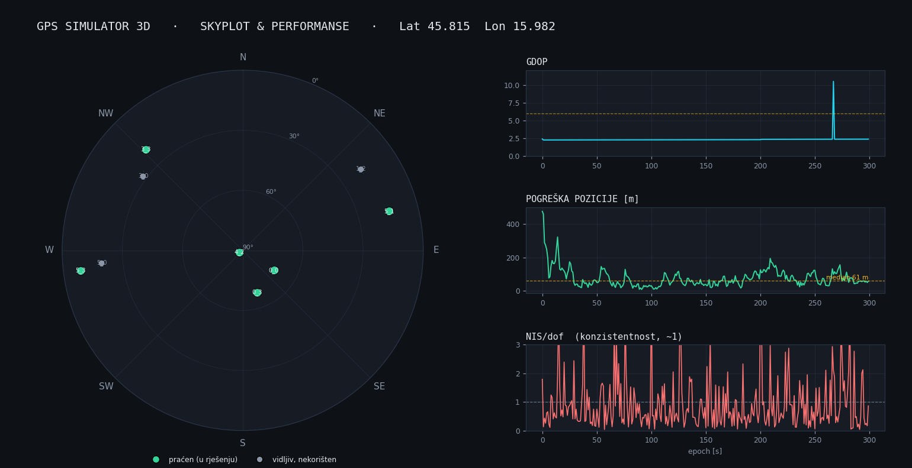
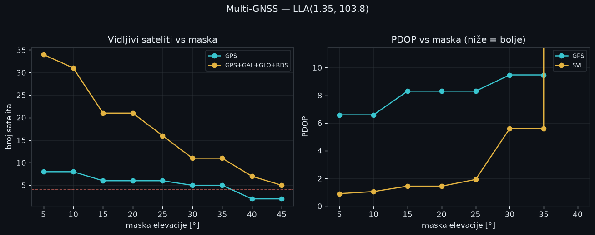
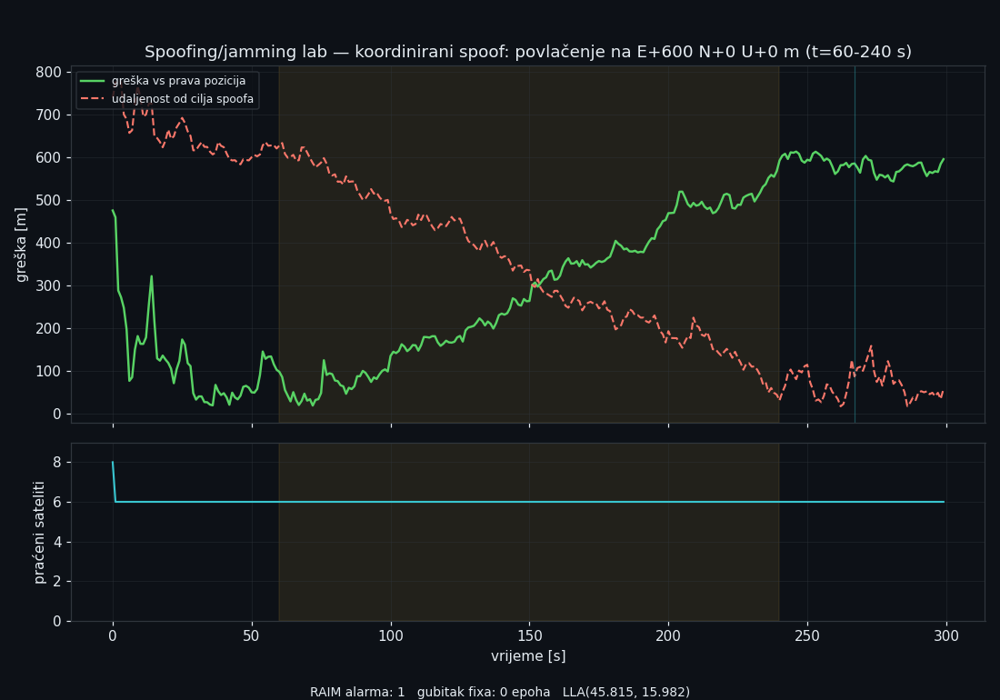
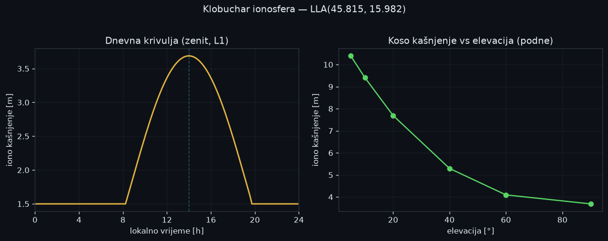

# GPS Simulator 3D

*[🇭🇷 Hrvatska verzija](README.md) · [Technical deep-dive](GPS_Simulator_Documentation.md) · [The Sagnac bug story](docs/sagnac-bug.md)*

A software-defined **GNSS simulator with a real navigation processor** — not a
toy that draws satellites, but a full signal-to-position pipeline whose core
would run on real measurements. Errors are injected at the **measurement** level
(ionosphere, troposphere, multipath, clocks, relativity, ephemeris) and solved
by **textbook GNSS algorithms**: least-squares cold start → **11-state Extended
Kalman Filter** (position/velocity/clock/drift + inter-system bias) →
**MAD-robust RAIM** → elevation-dependent measurement noise → NIS consistency
diagnostics.

Two front-ends over one headless `numpy` engine: a desktop 3D view (PyVista/VTK)
and a web **control center + GNSS academy** (FastAPI + CesiumJS, bilingual).

> **What's real vs. simulated?** Everything *above the signal layer* is
> authentic — the solver is the same algorithm that would run on a real
> receiver. The RF layer is a faithful but calibrated model: real C/A **Gold
> codes** and FFT correlation, but each satellite is decoded from its own channel
> (no carrier-phase tracking or combined-signal near-far model yet). See the
> [honest self-assessment](GPS_Simulator_Documentation.md#8-osvrt-i-analiza-iskreno).

---

## Highlights

- **Real navigation solver** — 11-D EKF + RAIM + iono-free dual-frequency (L1/L2)
  + inter-system bias estimation. Satellite selection uses the *estimated*
  position, never the truth ("the receiver may not know what it couldn't know").
- **Physics with depth** — Klobuchar ionosphere (time-of-day), Hopfield
  troposphere, Sagnac, eccentricity-dependent relativity, Allan-variance clocks,
  J2 orbital precession, real global DEM (NASA SRTM) with line-of-sight
  raycasting through terrain.
- **Spoofing / jamming lab** — attacks injected at the measurement level pass
  through the real EKF/RAIM. A *coordinated* spoof is not caught by RAIM — a
  correct, honest result that demonstrates a genuine vulnerability, not a bug.
- **Correlated-error realism** — L1/L2 multipath shares one reflection geometry
  (so iono-free no longer over-inflates it ~3×); ephemeris error is a
  slowly-varying Gauss-Markov process, not white noise.
- **Zero-noise consistency test** — turn every noise source off and the solution
  collapses to ~10 µm, proving every injected term is exactly cancelled by its
  correction (this is how the [Sagnac bug](docs/sagnac-bug.md) is now guarded).
- **Engineering hygiene** — 60 tests, CI on Python 3.11–3.13, a single seeded
  `Generator` threaded through every noise source (byte-reproducible), headless
  engine fully decoupled from the GUI.
- **Educational web layer** — live globe, click-to-place receiver, glossary
  popovers over live numbers, guided lessons that drive the app, bilingual HR/EN.

---

## Gallery

Headless analysis tools render figures directly from the engine:

| Skyplot + GDOP / error / NIS | Multi-GNSS availability + ISB |
|---|---|
|  |  |

| Spoofing / jamming lab | Klobuchar ionosphere (diurnal) |
|---|---|
|  |  |

> The 3D web control center and desktop globe are interactive; run them locally
> to explore (see below). *(Animated GIFs of the live UI to follow.)*

---

## Quickstart

Works on Windows, macOS and Linux (the engine is pure Python; only launchers and
paths differ).

```bash
python -m venv .venv
# Windows: .venv\Scripts\activate   |  Linux/macOS: source .venv/bin/activate
pip install -r requirements-dev.txt      # engine + tests (no GPU)
# pip install -r requirements-viz.txt    # add the 3D desktop GUI

python benchmark.py     # headless: EKF convergence + error statistics
python skyplot.py       # skyplot + GDOP/error/NIS plots  -> skyplot.png
python spoofing.py --attack coordinated --plot   # spoofing/jamming lab
python multignss.py     # GPS+GAL+GLO+BDS: availability / PDOP / ISB
pytest                  # 60 tests
```

One-command setup: **`setup.bat`** (Windows) or **`./setup.sh`** (macOS/Linux)
creates the venv and installs everything.

### Web control center + GNSS academy

Interactive 3D globe (CesiumJS), live simulation, click-to-place receiver,
telemetry, glossary and guided lessons — the existing engine driven live over a
FastAPI backend. Build once (needs Node 18+), then run:

- **Windows:** `build_web.bat` → `run_webapp.bat`
- **macOS/Linux:** `./build_web.sh` → `./run_webapp.sh` (or `./gps.sh web`)

The browser opens automatically once the server is up. Details in
[`web/README.md`](web/README.md).

---

## How it works (one diagram)

```
Visible sats (elev > 5°, LOS through terrain)
      │
      ▼  DOP selection (10 best, greedy, from the ESTIMATE)
RF channel + FFT correlation (L1 & L2, 8× oversampled)
      │
      ▼  iono-free combination (cancels the ionosphere)
Measurement corrections (+ rx clock, − troposphere, + Sagnac, + ISB)
      │
      ▼  11-state EKF  →  RAIM (MAD outlier rejection)
Position + GDOP + NIS
```

Full architecture, block diagrams and model derivations:
[`GPS_Simulator_Documentation.md`](GPS_Simulator_Documentation.md).

---

## Repository map

| Module | Role |
|--------|------|
| `physics_engine.py` | Orbits (Kepler + J2), iono/tropo, relativity, clocks, slowly-varying ephemeris |
| `satellite.py` | Satellites + Walker-Delta and multi-GNSS (GPS/GAL/GLO/BDS) constellations |
| `signal_processing.py` | Real C/A **Gold codes**, RF channel (correlated L1/L2 multipath + AWGN), 8× FFT correlation |
| `receiver.py` | LS cold start → 11-D EKF → RAIM → DOP selection; iono-free, Sagnac, ISB |
| `terrain.py` | Global DEM (NASA SRTM) + bilinear interpolation |
| `utils.py` | Geodesy: LLA ↔ ECEF on the WGS-84 ellipsoid |
| `main.py` | PyVista desktop GUI (the only part that needs a GPU) |
| `web/` | Web control center + GNSS academy (FastAPI + CesiumJS) |
| `rtk.py` · `spoofing.py` · `multignss.py` · `iono.py` · `skyplot.py` · `scenario.py` · `benchmark.py` | Standalone headless tools |

---

## Tests & reproducibility

`pytest` (config in `pyproject.toml`). Every noise source takes an explicit
`np.random.Generator` shared by the constellation and receiver, so results are
byte-reproducible without global state. CI runs the suite on Python 3.11–3.13.
A **zero-noise consistency test** guards against the whole class of
"truth leaking into the receiver" bugs — the class the
[Sagnac bug](docs/sagnac-bug.md) belonged to.

---

## License & data

Terrain (`terrain_dem.npz`) is derived from NASA SRTM RAMP2 (public domain);
`earth_texture.jpg` is NASA Blue Marble (public domain).
